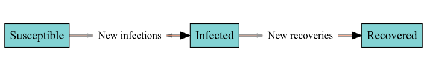
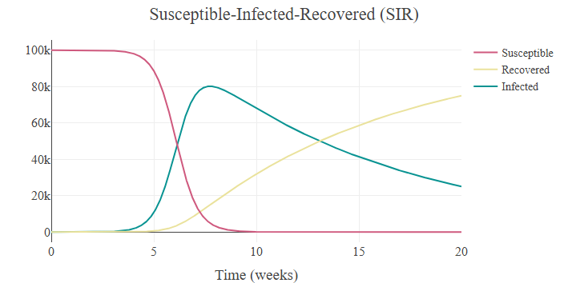

# sdbuildR: An Accessible Interface for Stock-and-Flow Modelling in R

**sdbuildR** is an R package for building, simulating, and exploring
stock-and-flow models. Originating in the field of system dynamics,
stock-and-flow models represent processes as quantities (stocks) that
accumulate or deplete over time and the processes (inflows and outflows)
that change them. **sdbuildR** is designed to make stock-and-flow
modelling accessible to a broad audience, requiring minimal mathematical
or system dynamics background knowledge.

## Quick start

Load one of the dozens of models from the built-in library, such as the
classic SIR (Susceptible-Infected-Recovered) epidemic model:

``` r

library(sdbuildR)

# Load stock-and-flow model
sfm <- stockflow("sir")

# View the stock-and-flow diagram
plot(sfm)
```



``` r

# Simulate and visualise the dynamics over time
simulate(sfm) |> plot()
```



The [**Get started
guide**](https://kcevers.github.io/sdbuildR/articles/sdbuildR.html)
provides a step-by-step tutorial on building and simulating
stock-and-flow models using interactive plots.

## Installation

The release version can be installed from CRAN:

``` r

install.packages("sdbuildR")
```

The development version can be installed from GitHub:

``` r

if (!require("remotes")) install.packages("remotes")
remotes::install_github("KCEvers/sdbuildR")
```

## Overview of main features

sdbuildR is designed to support the iterative process of building,
simulating, and testing stock-and-flow models. Models can flexibly be
modified and simulated in either R or Julia [(see setup
guide)](https://kcevers.github.io/sdbuildR/articles/julia-setup.html)
for a major speed-up on large or repeated runs. All package capabilities
are described in the vignettes:

- [Get
  started](https://kcevers.github.io/sdbuildR/articles/sdbuildR.html): A
  guided tour of the main features.
- [Build](https://kcevers.github.io/sdbuildR/articles/build.html):
  Build, modify, and simulate stock-and-flow models.
- [Ensemble
  simulations](https://kcevers.github.io/sdbuildR/articles/ensemble.html):
  Explore a model’s behaviour across parameter ranges and initial
  conditions.
- [Unit
  tests](https://kcevers.github.io/sdbuildR/articles/unit-tests.html):
  Verify models behave as intended with unit tests.
- [Job Demands-Resources
  Theory](https://kcevers.github.io/sdbuildR/articles/jdr.html): An
  example of formalizing psychological theory with sdbuildR.
- [Julia
  setup](https://kcevers.github.io/sdbuildR/articles/julia-setup.html):
  Set up Julia for faster simulations.
- [Import/Export](https://kcevers.github.io/sdbuildR/articles/import-export.html):
  Import models from deSolve or Insight Maker, and export to other
  formats.

## Other system dynamics software

sdbuildR is heavily based on common system dynamics software such as
[Vensim](https://en.wikipedia.org/wiki/Vensim),
[Powersim](https://powersim.com/),
[Stella](https://www.iseesystems.com/), and [Insight
Maker](https://insightmaker.com/). To translate xmile models to R, see
the R package [readsdr](https://CRAN.R-project.org/package=readsdr). To
build stock-and-flow models with the R package
[deSolve](https://CRAN.R-project.org/package=deSolve), the book [System
Dynamics Modeling with
R](https://link.springer.com/book/10.1007/978-3-319-34043-2) by Jim
Duggan will prove useful. In Python, stock-and-flow models are supported
by [PySD](https://doi.org/10.21105/joss.04329).

## Troubleshooting

sdbuildR is under active development. While thoroughly tested, the
package may have bugs, particularly in complex model translations. We
encourage users to report [issues on
GitHub](https://github.com/KCEvers/sdbuildR/issues) - your input helps
the package improve! Use
[`summary()`](https://rdrr.io/r/base/summary.html) to run model
diagnostics, and use the vignettes for guidance.

## Citation

To cite sdbuildR, please use:

``` r

citation("sdbuildR")
#> To cite package 'sdbuildR' in publications use:
#> 
#>   Evers, K. (2026). sdbuildR: An Accessible Interface for
#>   Stock-and-Flow Modelling in R. R package version 2.1.0.
#>   https://doi.org/10.32614/CRAN.package.sdbuildR
#> 
#> A BibTeX entry for LaTeX users is
#> 
#>   @Manual{sdbuildR,
#>     title = {{sdbuildR}: An Accessible Interface for Stock-and-Flow Modelling in R},
#>     author = {Kyra Caitlin Evers},
#>     year = {2026},
#>     note = {R package version 2.1.0},
#>     url = {https://kcevers.github.io/sdbuildR/},
#>     doi = {10.32614/CRAN.package.sdbuildR},
#>   }
```
